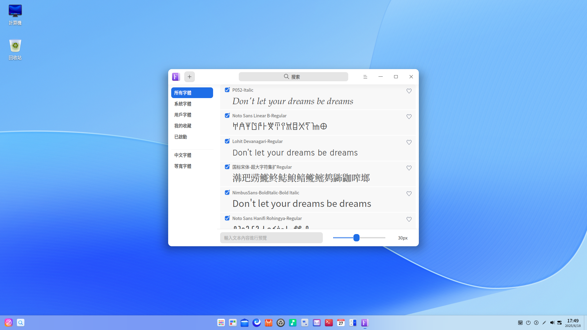
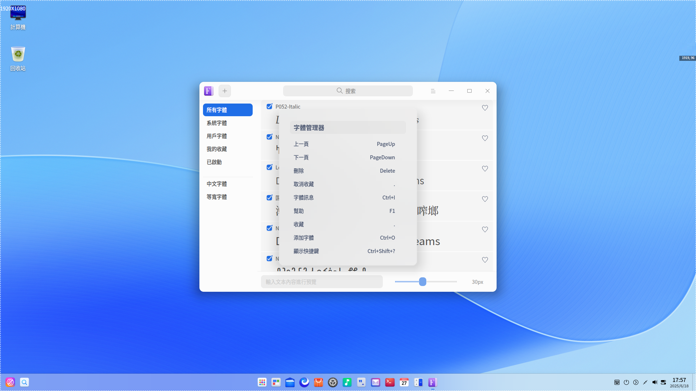
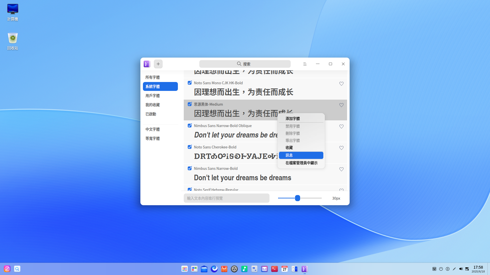

# 字體管理器|deepin-font-manager|

## 概述

字體管理器是一款功能強大的字體管理工具，可以幫助用戶安裝字體，並且具有查找、啟用、禁用、收藏、刪除字體等功能，還可以通過輸入文本內容、設置文本大小進行字體預覽。

字體管理器支持安裝的字體格式有ttf、ttc、otf。

## 使用入門

您可以通過以下方式運行或關閉字體管理器，或者創建字體管理器的快捷方式。

### 運行字體管理器

1. 單擊任務欄上的啟動器圖標 ，進入啟動器界面。
2. 上下滾動鼠標滾輪瀏覽或通過搜索，找到字體管理器圖標 ，單擊運行。
3. 右鍵單擊 ，您可以：

   - 單擊 **傳送到桌面**，在桌面創建快捷方式。
   - 單擊 **傳送到任務欄**，將應用程序固定到任務欄。
   - 單擊 **加至開機啟動**，將應用程序添加到開機啟動項，在電腦開機時自動運行該應用。

### 關閉字體管理器

- 在字體管理器界面單擊 ，關閉字體管理器。
- 在任務欄右鍵單擊 ，選擇 **關閉所有**，關閉字體管理器。
- 在字體管理器界面單擊 ，選擇 **退出**，關閉字體管理器。

### 查看快捷鍵

在字體管理器界面，使用快捷鍵 **Ctrl + Shift + ?** 打開快捷鍵預覽界面。熟練地使用快捷鍵，將大大提升您的操作效率。

## 操作介紹

### 界面介紹

| 名稱     | 說明                                                       |
| -------- | ---------------------------------------------------------- |
| 所有字體 | 系統字體和用戶字體的集合，默認顯示所有字體。               |
| 系統字體 | 系統自帶的字體列表，不能被禁用和刪除。             |
| 用戶字體 | 用戶安裝的字體列表。                                         |
| 我的收藏 | 用戶收藏的字體列表。 |
| 已啟動   | 啟用狀態的所有字體合集。                                   |
| 中文字體 | 所有字體集中的中文字體。                     |
| 等寬字體 | 所有字體中字符寬度相同的字體。                             |

### 安裝字體

字體管理器可以安裝單個字體，也可以批量安裝多個字體，您可以通過以下方式進行安裝。

- 在字體管理器界面，單擊左上角的添加按鈕  或  > **添加字體**，或右鍵單擊字體並選擇 **添加字體**，選擇需要安裝的字體文件。
- 右鍵單擊字體文件並選擇 **打開方式** > **字體管理器**，進入字體管理器界面，安裝字體。
- 雙擊字體文件，安裝字體。
- 將字體文件拖拽到字體管理器界面或圖標上。

> 說明: 
> - 字體管理器會自動檢測您的字體，如果本地已經安裝過該字體，會顯示已安裝相同版本的提示訊息，此時可以選擇  **退出**  或 **繼續** 安裝操作。
> - 您可以打開 **控制中心** > **個性化** > **字體** 來設置 **標準字體**。

### 預覽字體

字體集中字體的每個文本塊呈現着字體的樣式，可以通過預覽字體來體驗字體的顯示效果。

默認預覽文案中文為「因理想而出生，為責任而成長」。

1. 在字體管理器底部字體預覽輸入框中輸入文本內容。
2. 通過左右拖動滑塊設置字體大小，在字體集列表中查看字體顯示效果。

   > 說明：向左滑動滑塊為縮小字體，向右滑動滑塊為放大字體，字體大小範圍為6px-60px。

### 搜索字體

1. 在字體管理器搜索框中，單擊 。
2. 輸入關鍵字，實時展示搜索結果。
3. 在搜索框中單擊 ，或刪除搜索框中輸入的訊息，即可清除當前輸入的搜索條件或取消搜索。

### 導出字體

1. 在用戶字體列表，右鍵單擊字體。
2. 選擇 **導出字體** ，成功導出字體文件後，界面下方會彈出提示信息。

導出字體默認存儲路徑：桌面文件夾，文件夾默認名稱：字體

> 說明：既支持導出單個字體，也支持批量導出字體。系統字體不能被導出。

### 收藏/取消收藏字體

當您需要收藏或者取消收藏一個字體時，可以使用字體管理器執行該操作。
1. 選擇一個未被收藏的字體並單擊其右側  圖標，或右鍵單擊該字體，選擇 **收藏**。

2. 選擇一個已被收藏的字體並單擊其右側  圖標，或右鍵單擊該字體，選擇 **取消收藏**。

   被收藏的字體會在「我的收藏」列表中顯示。

> 說明：既支持收藏/取消收藏單個字體，也支持批量收藏/取消收藏字體。

### 啟用/禁用字體 

您可以在字體管理器中啟用或禁用「用戶字體」。用戶字體默認為已啟用狀態。

1. 在用戶字體列表，取消已勾選的字體狀態，或右鍵單擊該字體，選擇 **禁用字體** 來禁用該字體。

2. 勾選被禁用的字體，或右鍵單擊該字體，選擇 **啟用字體** 來啟用該字體。

   已啟用的字體會在「已啓動」列表中顯示。

> 說明：既支持啟用/禁用單個字體，也支持批量啟用/禁用字體。系統字體和系統正在使用的用戶字體不可被禁用。

### 查看字體基本訊息

您可以通過字體管理器查看字體基本訊息。

1. 在字體管理器界面，右鍵單擊字體。
2. 選擇 **訊息**，查看該字體的具體信息。

### 查看字體安裝位置

您可以通過字體管理器查看字體安裝位置。

1. 在字體管理器界面，右鍵單擊字體。
2. 選擇 **在檔案管理員中顯示**，查看字體安裝位置。

### 刪除字體

當您需要刪除字體時，可以使用字體管理器執行該操作。

> 說明：既支持刪除單個字體，也支持批量刪除字體。系統字體和系統正在使用的用戶字體不能被刪除。

1. 在 **用戶字體** 列表，右鍵單擊字體。
2. 選擇 **刪除字體**。
3. 在彈出的提示對話框中單擊 **刪除** 。

## 主菜單

在主菜單中，您可以切換窗口主題、查看幫助手冊，了解字體管理器的更多訊息。

### 主題

窗口主題包含淺色主題、深色主題和系統主題。

1. 在字體管理器界面，單擊 。
2. 選擇 **主題**，選擇一個主題顏色。

### 幫助

查看幫助手冊，進一步了解和使用字體管理器。

1. 在字體管理器界面，單擊 。
2. 選擇 **幫助**。
3. 查看字體管理器的幫助手冊。

### 關於

1. 在字體管理器界面，單擊 。
2. 選擇 **關於**。
3. 查看字體管理器的版本和介紹。

### 退出

1. 在字體管理器界面，單擊 。
2. 選擇 **退出**。

